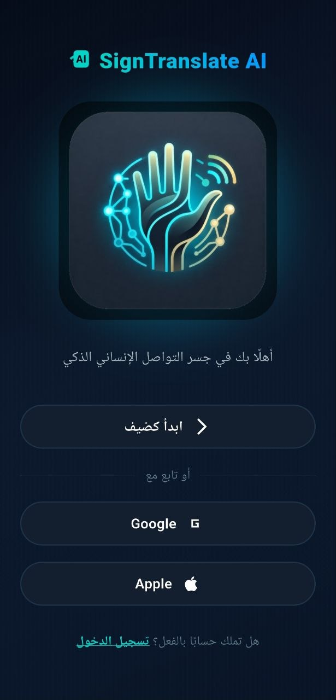
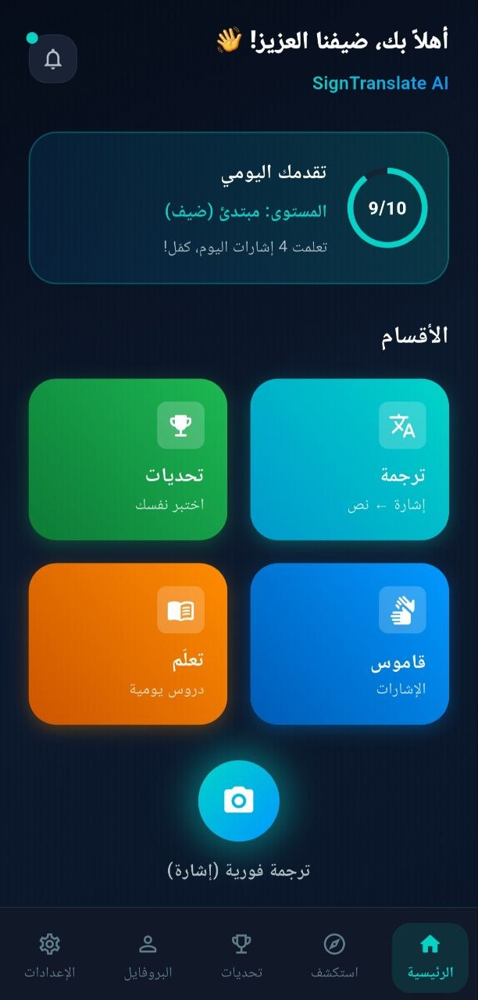
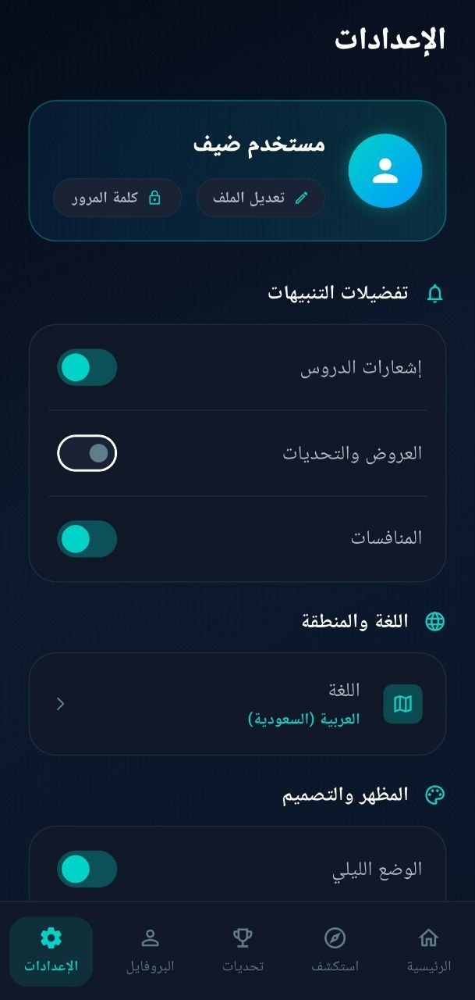
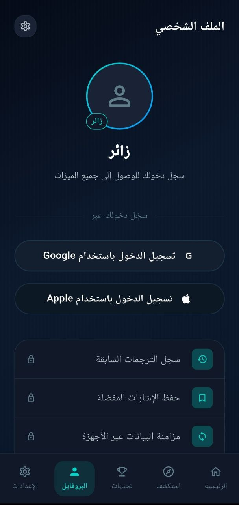
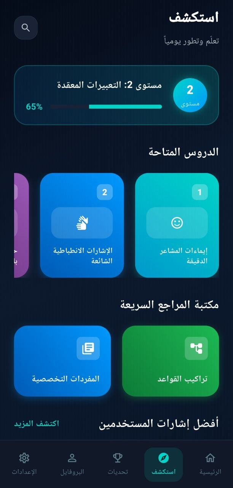
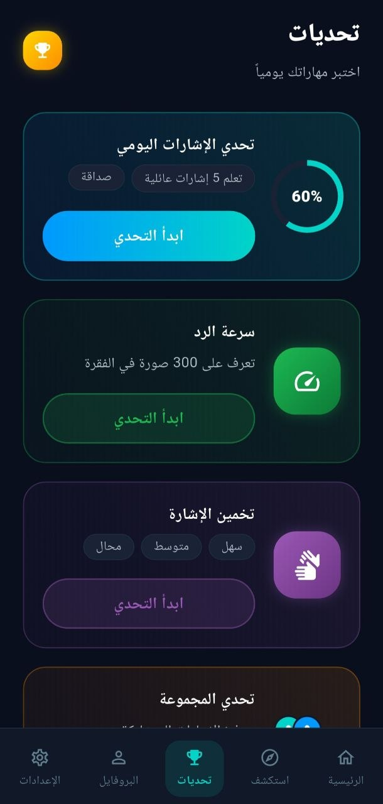
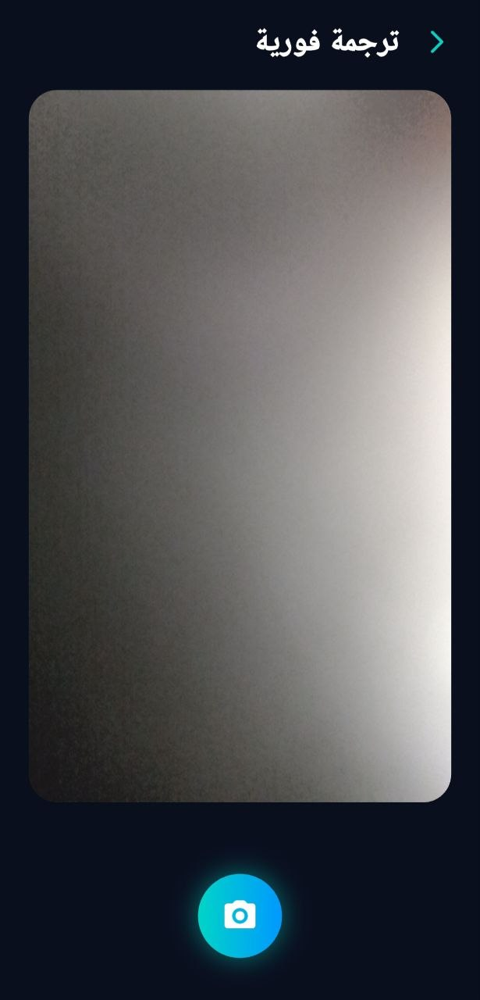

# إيماء - SignTranslate AI 🤟

تطبيق موبايل ذكي لترجمة لغة الإشارة العربية في الوقت الفعلي، مبني بـ Flutter ومدعوم بنموذج ذكاء اصطناعي.

## لقطات الشاشة







## المميزات

- 🔤 التعرف على 28 حرف عربي بلغة الإشارة
- 🔢 التعرف على الأرقام 0-9
- 📷 ترجمة فورية عبر الكاميرا
- 📚 قاموس إشارات تفاعلي
- 🏆 نظام تحديات يومية
- 📖 دروس تعليمية خطوة بخطوة
- 👤 دخول كضيف أو تسجيل بـ Google/Apple

## التقنيات المستخدمة

### Frontend
- Flutter (Dart)
- Camera package
- HTTP package

### AI Backend
- Python + FastAPI
- MediaPipe Hands (استخراج 21 نقطة من اليد)
- XGBoost (تصنيف الإشارات)
- دقة النموذج: 90.67%

## هيكل المشروع
lib/
├── core/
│ ├── AppDim.dart # أبعاد responsive
│ ├── app_routes.dart # التنقل بين الصفحات
│ └── theme/
│ ├── app_colors.dart # الألوان
│ └── app_theme.dart # الثيم
├── screens/
│ ├── welcome_screen.dart
│ ├── home_screen.dart
│ ├── explore_screen.dart
│ ├── learn_screen.dart
│ ├── challenges_screen.dart
│ ├── profile_screen.dart
│ ├── settings_screen.dart
│ ├── translate_screen.dart
│ └── camera_screen.dart
├── widgets/
│ ├── teal_press_button.dart
│ ├── ..
│ └── ..
└── services/
└── translate_service.dart

## كيف يعمل نظام الترجمة
كاميرا الموبايل تلتقط صورة
↓
Flutter يرسلها لـ FastAPI
↓
MediaPipe يستخرج 63 نقطة من اليد
↓
XGBoost يتعرف على الإشارة
↓
يرجع الحرف/الرقم + نسبة الدقة
## تشغيل المشروع

### المتطلبات
- Flutter SDK 3.10+
- Python 3.11
- Conda

### Flutter
```bash
flutter pub get
flutter run
```

### AI Backend
```bash
conda activate sign_ai
pip install mediapipe==0.10.9 opencv-python numpy xgboost fastapi uvicorn python-multipart
uvicorn api:app --host 0.0.0.0 --port 8000
```

### تغيير رابط الـ API
في `lib/services/translate_service.dart`:
```dart
static const String _baseUrl = 'http://YOUR_IP:8000';
```

## مصادر البيانات

- [Arabic Sign Language ArSL Dataset](https://www.kaggle.com/datasets/sabribelmadoui/arabic-sign-language-unaugmented-dataset)
- Arabic Sign Language Numbers Dataset (Kaggle)

## نموذج الذكاء الاصطناعي

- الرابط: [arabic-sign-language-model](https://github.com/bashayer-BR/arabic-sign-language-model)

## المطور

**بشاير **